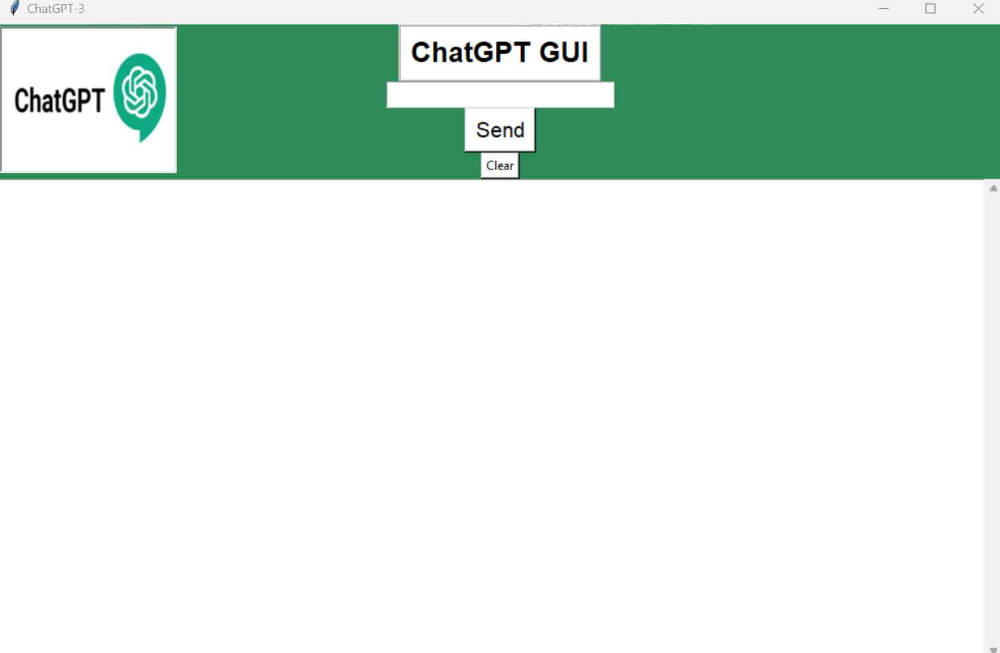

# ChatGPT-GUI
ChatGPT Graphical User Interface (GUI) Based on Tkinter.

<p align="center">
  
</p>

## Quick Start

- Create Conda Environment

```
conda create –n ChatGPT python=3.8
conda activate ChatGPT
```
- Install Requirements

```
pip install -r requirements.txt
```

- Run

```
python App.py
```

## Interface

<p align="center">
  
</p>
